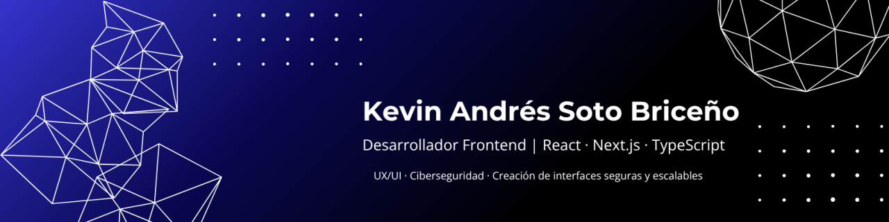

  <a href="mailto:KevinS9sotob@hotmail.com">📧 Email</a> • 
  <a href="https://portfolio-kevinsoto9s-projects.vercel.app/">🌐 Portafolio</a> • 
  <a href="https://github.com/KevinSoto9">💻 GitHub</a> • 
  <a href="https://www.linkedin.com/in/kevin-andr%C3%A9s-soto-brice%C3%B1o-833a8a31b/">🔗 LinkedIn</a>

---

## 🧠 Sobre Mí

Soy un desarrollador web full stack con formación técnica en desarrollo de aplicaciones web y estudios avanzados en ciberseguridad. Me encanta aprender nuevas tecnologías y aplicar lo aprendido en proyectos reales.

---

## 🎓 Educación

- 🎓 **Curso de Especialización en Ciberseguridad**  
  *MEDAC* — 01/2025 - 06/2025

- 🎓 **Grado Superior en Desarrollo de Aplicaciones Web**  
  *I.E.S Salduba* — 2022 - 2024

- 🎓 **Bachillerato Tecnológico**  
  *I.E.S Victoria Kent* — 2020 - 2022

---

## 💼 Experiencia

### 💼 Diseñador y Desarrollador Web Freelance - Construcciones Soto
**Construcciones Soto**  
📅 Septiembre 2025 – Octubre 2025

- Desarrollo de la web corporativa para una empresa con más de 20 años de experiencia, mejorando su imagen digital y la captación de clientes
- Diseño de la arquitectura de contenido y jerarquía de servicios (Construcción, Fontanería, Electricidad) con enfoque en credibilidad visual
- Implementación de diseño responsive y multilingüe (ES/EN), optimizando la conversión y la experiencia de usuario en un 35%
- Desarrollo del módulo “Nuestros Proyectos” con rich media interactiva y contacto directo vía WhatsApp y formulario optimizado

🌐[Sitio Web](https://www.constsoto.es/)

### 💼 Diseñador y Desarrollador Web Freelance - Bangkok Thai Massage
**Bangkok Thai Massage**  
📅 Mayo 2025 – Junio 2025

- Diseño visual acorde a la identidad del negocio
- Desarrollo de una web responsive compatible con móviles y tablets
- Creación de una estructura clara y fácil de navegar
- Integración de contenido, imágenes y Google Maps
- Soporte técnico y mantenimiento posterior al lanzamiento

🌐[Sitio Web](https://bangkokthaimassagemarbella.es/)

### 👨‍💻 Programador Web Junior (Prácticas)  
**Hospital Ochoa - Marbella**  
📅 Abril 2024 – Junio 2024

- Desarrollo de aplicación para gestión de citas médicas.
- Apoyo en la infraestructura de red interna.
- Tecnologías usadas: PHP, React, JS.
---

## 🚀 Proyectos Destacados

### 🛍️ [ShopRadar](https://shopradarweb.vercel.app/)

> ShopRadar es una aplicación web frontend de demostración para buscar y comparar precios de productos en diferentes tiendas.

- 🧪 Tecnologías: React.js, Tailwind, TypeScript
- 📂 [Repositorio](https://github.com/KevinSoto9/ShopRadar)

---

### 🔠 [TypeScript links](https://type-script-links.vercel.app/)

> Repositorio de recursos y ejemplos de TypeScript.

- 🧪 Tecnologías: HTML5, Tailwind
- 📂 [Repositorio](https://github.com/KevinSoto9/TypeScript-links)

---

### 🔍 [Como Usar Volatility3](https://como-usar-volatility.vercel.app/)

> Proyecto educativo sobre análisis forense de memoria con Volatility3.

- 🧪 Tecnologías: Next.js, TypeScript, Tailwind, React
- 📂 [Repositorio](https://github.com/KevinSoto9/ComoUsarVolatility)

---

### 🦇 [Batman Wiki](https://batman-wiki.vercel.app/)

> Enciclopedia visual de personajes del universo Batman usando una API pública.

- ⚙️ Tecnologías: React, TypeScript, TailwindCSS, React Router
- 📂 [Repositorio](https://github.com/KevinSoto9/BatmanWiki)

---

## 🛠️ Habilidades Técnicas

  

---

## 📈 GitHub Stats

  
   
  

---

## 📫 ¡Conectemos!

- ✉️ **Email**: [KevinS9sotob@hotmail.com](mailto:KevinS9sotob@hotmail.com)  
- 🌐 **Portafolio**: [portfolio-kevinsoto9s-projects.vercel.app](https://portfolio-kevinsoto9s-projects.vercel.app/)  
- 💼 **LinkedIn**: [Mi perfil](https://www.linkedin.com/in/kevin-andr%C3%A9s-soto-brice%C3%B1o-833a8a31b)  

---
